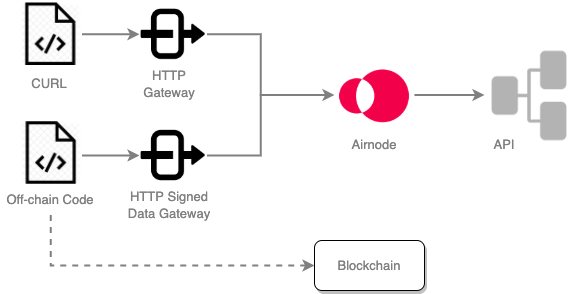

<TitleSpan>创建一个 Airnode</TitleSpan>

# {{$frontmatter.title}}

<VersionWarning/>

<TocHeader /> <TOC class="table-of-contents" :include-level="[2,3]" />

作为Airnode 部署的一部分，您可以决定部署两个不同的 HTTP 网关。

- HTTP 网关：测试
- HTTP 签名数据网关：生产使用

## 网关的差异

两种网关的设置是相同的。 不同之处在于它们的目的和反应。 只有在部署到AWS和GCP时才允许网关。

> 

### HTTP网关

常规的HTTP网关是严格用于测试的。 使用像CURL这样的简单工具，你可以测试Airnode配置中的端点是否正常工作，而无需访问区块链。

### HTTP 签名数据网关

HTTP签名的数据网关是用于生产目的。 虽然它的执行方式与HTTP网关类似，但其响应是经过签名的，不包含`rawValue`字段。 该网关由链外代码源执行，该代码源可能反过来将数据推送到区块链上。

## 设置

启用 `config.json` 文件中的字段 `nodeSetings.httpGateway` 和 `nodeSettings.httpSignedDataGatel`。

- **enabled**: 开启/禁用网关的布尔值。
- **apiKey**: 用户定义的 API 密钥来验证网关。 密钥长度必须介于 30 - 120 个字符之间。
- **maxConcurrency**: (可选) 一个高于零的数字，代表了为网关请求服务的无服务器函数的 最大数量。 当省略时，没有设置最大并发数。

```json
"nodeSettings": {
  "cloudProvider": {
    "type": "aws",
    "region": "us-east-1"
  },
  "airnodeWalletMnemonic": "${AIRNODE_WALLET_MNEMONIC}",
  "heartbeat": {...},
  "httpGateway": {
    "enabled": true,
    "apiKey": "${HTTP_GATEWAY_API_KEY}",
    "maxConcurrency": 20
  },
  "httpSignedDataGateway": {
    "enabled": true,
    "apiKey": "${HTTP_SIGNED_DATA_GATEWAY_API_KEY}",
    "maxConcurrency": 20
  },
  ...
},
```

在 `triggers.http[n]`和/或`triggers.httpSignedData[n]`数组中，添加网关可以响应的预期端点。 相应的数组不需要匹配。 可能想测试所有的端点，但只能通过HTTP签名数据网关或通过RRP服务某些端点。

```json
// in config.json
"triggers": {
  "rrp": [
    {
      "endpointId": "0xf466b8feec41e9e50815e0c9dca4db1ff959637e564bb13fefa99e9f9f90453c",
      "oisTitle": "CoinGecko Basic Request",
      "endpointName": "coinMarketData",
    }
  ],
  "http": [
    {
      "endpointId": "0xf466b8feec41e9e50815e0c9dca4db1ff959637e564bb13fefa99e9f9f90453c",
      "oisTitle": "CoinGecko Basic Request",
      "endpointName": "coinMarketData",
    }
  ],
  "httpSignedData": [
    {
      "endpointId": "0xf466b8feec41e9e50815e0c9dca4db1ff959637e564bb13fefa99e9f9f90453c",
      "oisTitle": "CoinGecko Basic Request",
      "endpointName": "coinMarketData",
    }
  ]
}
```

## 网关URL

当Airnode部署时，每个网关（当启用时）都会生成一个网关的URL。 您可以获取 `api.httpGatewayUrl` 和 `api. tpSignedDataGatewayUrl` ，两者来自于 [receivt.json](../../../reference/deployment-files/receipt-json.md) 文件， 由 Airnode 部署器返回。 它们也可以作为从Airnode的[heartbeat](./heartbeat.md) 发送至你指定的heartbeat URL的有效载荷的一部分。

## 使用 CURL

为了执行由任一网关提供的端点，作为CURL调用的一部分，需要做到以下几点。

- 以`endpointId`作为路径参数发出一个POST请求。 可以在config.json中的 `triggers.http.endpointId` 或`triggers.httpSignedData.endpointId`下找到`endpointId`。
- 添加`Content-Type`头部，设置为`application/json`。
- 添加 `x-api-key` 头, 设置为 apiKey `x-api-key`可以在config.json的`nodeSettings.httpGateway.apiKey`或`nodeSettings.httpSignedDataGateway.apiKey`下找到。
- 将参数/编码参数放在请求正文中。

<style type="text/css" rel="stylesheet">
.tSmall { font-size:x-small; margin-left:13px;}
</style>

| CURL 参数                                         | 输入     | CURL 选项                                                   |
| ----------------------------------------------- | ------ | --------------------------------------------------------- |
| Content-Type                                    | header | `-H 'Content-Type: application/json'`                     |
| x-api-key                                       | header | `-H 'x-api-key: 8d890a46-799d-48b3-a337-8531e23dfe8e'`    |
| endpointId                                      | path   | `<gatewayUrl>/0xf466b8feec...99e9f9f90453c`         |
| \* parameters<div class="tSmall">HTTP Gateway</div>        | body   | `-d '{"parameters": {"param1": "myValue", "param2": 5}}'` |
| \* encodedParameters<div class="tSmall">HTTP Signed Data Gateway</div> | body   | `-d '{"encodedParameters": "0x3173737300....000"}'`       |

\* 网关参数的命名不同。 HTTP 签名数据网关要求使用 [Airnode ABI](../../../reference/specifications/airnode-abi-specifications.md)对`encodedParameters` 进行编码。

将以下示例中的 `<gatewayUrl>` 替换为使用 `httpGatewayUrl` 或 `httpSignedDataGatewayUrl` 字段的`receipt.json` 文件中的URL。 部署 Airnode 时会创建[receipt.json](../../../reference/deployment-files/receipt-json.md) 文件。

### 请求

:::: tabs

::: tab HTTP网关

```sh
curl \
-X POST \
-H 'Content-Type: application/json' \
-H 'x-api-key: 8d890a46-799d-48b3-a337-8531e23dfe8e' \
-d '{"parameters": {"param1": "myValue", "param2": 5}}' \
'<gatewayUrl>/0xf466b8feec...99e9f9f90453c'
```

:::

::: HTTP 签名数据网关

```sh
curl \
-X POST \
-H 'Content-Type: application/json' \
-H 'x-api-key: 8d890a46-799d-48b3-a337-8531e23dfe8e' \
-d '{"encodedParameters": "0x3173737300....000"}' \
'<gatewayUrl>/0xf466b8feec...99e9f9f90453c'
```

:::

::::

### 响应

:::: tabs

::: tab HTTP网关

```json
{
  "rawValue": { "usd": "6421.4" },
  "encodedValue": "0x0000000000000000000000000000000000000000000000000000000ef373e180",
  "values": ["64214000000"]
}
```

响应格式是一个简单的 JSON 对象，具有以下字段：

- `rawValue` - API 响应
- `values` - 被[提取并转换](../../../reference/packages/adapter.md#conversion)为目标类型后的数值数组
- `encodedValue` - 编码后的字节值，在链上的响应交易中作为有效载荷发送。

:::

::: tab HTTP签名数据网关

```json
{
  "data": {
    "timestamp": "1648226003",
    "value": "0x0000000000000000000000000000000000000000000000000000000a571a14c0"
  },
  "signature": "0xa74e4312e2e6fa2de2997ef43e417e3b82d0019ac2a84012300f706f8b213e0d6e1ae9301052ec25b71addae1b1bceb4617779abfc6acd5a951e20a0aaabe6f61b"
}
```

响应格式是一个简单的 JSON 对象，具有以下字段：

- `data.timestamp` - 应用于响应的时间戳。
- `data.value` - 响应中作为有效载荷发送的编码字节值。 适合于在链上使用。
- `signature` - 响应已被Airnode签名。

:::

::::

在 [快速部署AWS](../../tutorial/quick-deploy-aws/#execute-endpoint) 和 [快速部署GCP](../../tutorial/quick-deploy-gcp/#execute-endpoint) 教程中使用CURL 调用 HTTP 网关的其他例子。
