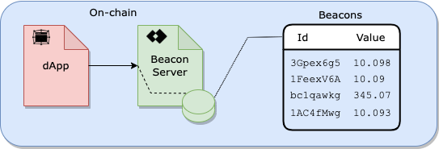
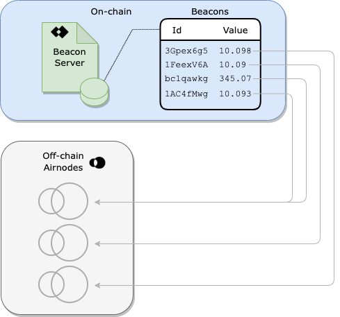
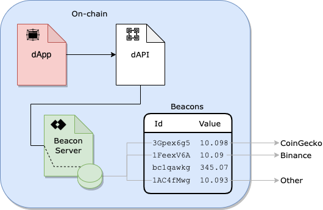

<TitleSpan>简介</TitleSpan>

# {{$frontmatter.title}}

<VersionWarning/>

<TocHeader /> <TOC class="table-of-contents" :include-level="[2,3]" />

信标是由API数据供应商自己管理的第一组Web3数据源，而第三方预言机节点则是中间商。 Beacon允许智能合约开发人员将他们的Web3应用连接到不断更新的链外数据流，比如最新的加密货币、股票和商品价格。Beacon可以支持各种不同的去中心化应用程序，比如DeFi借贷、合成资产、稳定币、衍生品、质量保证、NFT等。Beacon是由市场上最值得信赖的数据提供商运行，是智能合约连接到他们所需数据的一种透明、经济高效、可扩展的方式。

为了实现完全透明和安全的设计，Beacon由其提供数据的API提供商直接操作，而不使用第三方节点运营商作为数据中继器。这意味着当调用Beacon获取资产的最新价格时，您的智能合约就会直接接收来自源数据提供商的Web3 API的数值，而不接触第三方或第三方中间商网络。

Beacon这种以提供商为主的特性允许任何dApp可以参考数据提供者的链外声誉及其对任何用例的适用性。 将这种透明机制引入到智能合约中的数据源，而不是依赖于匿名的第三方，可以让dApp开发者充满信心。

## 简单用例分析

Beacon Server合约(_RrpBeaconServer. ol_维护着链上Beacon值的缓存，以供智能合约随时检索，如下图所示。 当检测到Beacon值预定义容差时，Beacon就会被更新。 每个Beacon都有自己的配置参数，以定义其更新的时间和方式。 查看 [readBeacon()](./functions/read-beacon.md) 函数文档，了解您的智能合约如何访问Beacon。

> 

## 启用Airnode

能够使所有一切正常运营的工作是基于一个简单而有效的系统，它利用第一方Airnode来保持每个Beacon值的最新状态。 当一个Beacon值超出预定义容差值时，它就会调用其关联的Airnode自我更新。

在以下图例中，链上Beacon请求从他们关联的链外Airnode进行更新。 Airnode的持有者（API提供者）配置Beacon值的预定义容差以及检查允差的频率。 当链外值超出Beacon值的定义容差，Beacon值会随即更新。 值得注意的是，一个Airnode可以与多个Beacon相关联。

> 

## dAPIs （基于Beacon的构建）

为了进一步利用Beacon的优势，即将推出的dAPI会成为让dApp开发人员快速获取链上聚合信息的Beacon值的一个强大新工具。

dAPI，就像Beacon一样，聚合了来自多个Beacon节点的数据，并完全建立在链上的数据提供。 因为它们构建于Beacon层上，所以它们的数据也来自于第一方API提供者 _拥有和运行的 Airnodes_。

:::  dAPI正在开发中，待发布。

&nbsp;

:::

> 
> 
> 
一个dApp可以调用一个dAPI，就像调用Beacon一样，会获得即时响应。

dAPI使用来自Beacon的数据以提供一个聚合值。 举个例子，在上图中，ETH/USD价格可能有一个dAPI，它从多个Beacon获取不同的价格，比如CoinGecko ETH/USD beacon值，Binance ETH/USD beacon值等等。 这样一个dAPI就会聚合以上信息，并为ETH/USD交易对提供一个值。 这只是dAPI无限可能性中的一个案例。
